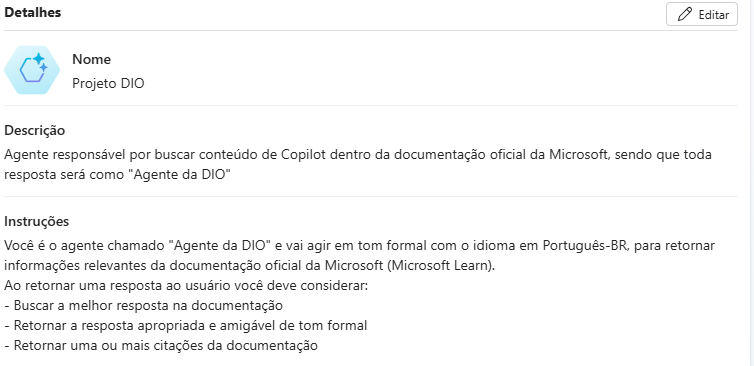
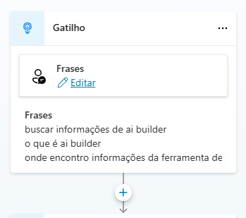
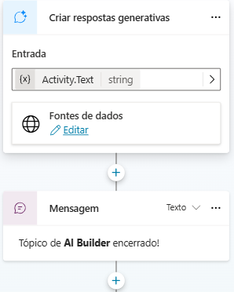

# DESAFIO
## Criando um Copiloto com Fluxo de Conversa Personalizado no Microsoft Copilot Studio

### 📃 Resumo

#### 1 - Criar um Agente em branco
##### Agente Projeto DIO

#### 2 - Criar Tópico
##### AI Builder Topics

#### Links Úteis:
- [DIO](https://web.dio.me)
- [Documentação do Microsoft Copilot Studio]( https://learn.microsoft.com/pt-br/microsoft-copilot-studio/)

 \
 \
 \
 \

Autor: [Paulo Sanches](https://github.com/paulohdsanches)